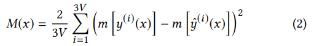
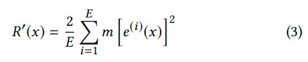
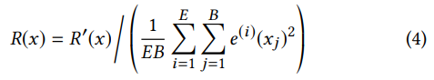
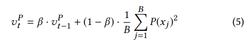
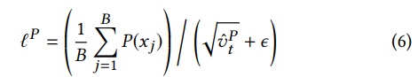

# Audio-Driven Facial Animation by Joint End-to-End Learning of Pose and Emotion
#### Tero Karras, Timo Aila, Samuli Laine, Antti Herva, Jaakko Lehtinen (SIGGRAPH 2017)

### Main Idea :
As audio-to-facial pose can is a complex one-to-many mapping, it is hard for a neural network to disambiguate possible poses for a given sound or phoneme. This paper presents a relatively simple way to solve this by learning jointly the output pose of a facial mesh and an *emotion* latent vector associated with every sound-window input in the dataset. 

### Main Takeaways :
* Learning latent vectors associated with each input can help disambiguation and avoids producing average poses for a given sound (or lack thereof).
* Learning such latent vectors seems mostly possible by adding a regularization term to the training based on the assumption or prior knowledge that such *emotion vector* features should vary at low frequencies compared to input sounds.
* Fine-tuning weights on multiple losses can be avoided with a Adam-inspired loss normalization technique. This seems to be a useful, general technique.
* A lot of manual filtering of the emotion vectors still need to be done to retreive naturally-recognizable emotions.

### Method
The architecture of the system is shown in the Figure 1 of the paper:

#### Data processing
The training data is composed of sound windows and associated 3D vertex positions of facial meshes.

The audio processing starts off with an auto-correlation layer (that I'm not familiar with) that computes K=12 auto-correlation coefficients for each audio frame. Their audio-windows of 520 ms are seperated into 64 overlapping audio-frames of 16ms. This results in this first layer outputing a 64x32 matrix for a given audio-window. I'm not familiar with audio-processing techniques, and I'm guessing that these auto-correlation computations are fixed, and that error gradients are not back-propagated into this layer. The following audio-processing part of the network is a series of standard Relu-activated convolution layers that are learned during training, along with the rest of the model.

The target data (poses) is acquired with a professional-grade facial tracking software that maps synchronized videos from 9 cameras to an unstructured facial mesh animation. From my understanding, this animation is retargeted to a custom-made, fixed-topology mesh, which is re-positioned and re-oriented automatically. The **deltas** from a neutral pose for each keyframe in that generated facial animation are exported as the training targets.

#### Emotion latent vectors
Each training input is augmented with a small (16 or 24 dimensional) latent vector for which each component is initialized by drawing from a normal distribution. These vectors are appended to each layer output of the articulation network shown in Figure 1. These are **learnable parameters** that should help the network disambiguate between emotion states for similar sounds. The authors explain that using too few dimensions for these vectors leads the network to not being able to disambiguate successfully, while using too many dimensions leads to emotion vectors that are *too specialized* and hard to extract for general inference.

#### Training losses
The main element for this technique to work seem to be in the way the authors define their losses and their regularization terms. 

The first loss, is the Position loss or *Position Term* as they call it which is the naïve loss that would come in mind to train such a network, where you want to minimize the distance between the outputs and the targets. Given *y* as the target vector for the *V* vertices of the mesh and *ŷ* as the output of the network, the *Position Term* is defined as the average squared difference of each vertex of the mesh:

As this can lead to unwanted jitter in the resulting animation since there is no temporal context in the ouput domain (the output for an audio-window does not depend on the previous or next one), an additional loss term, the *Motion Term* is added. The goal of this term is to push the network to model realistic motions between frames. This is done by sampling **pairs** of consecutive frames in each minibatch to retreive their instant motion - defined by the finite difference between the two. By defining the motion operator *m`[.]`* to retreive these finite differences, the *Motion Term* is defined as follows:

Finally, the most interesting loss comes as a regularization term to enable the learning of semantically plausible emotion vectors. The authors explain this regularization as a way to enforce short-term effects in the ouput-space to be influenced by sound and long-term effects by the emotional state. This makes intuitive senses as emotions generally vary slower than phonemes, while reducing ambiguity on the visual aspect of a face. Using the same finite difference operator as above, they first design this *Reglarization Term* for the emotion vector *e* as follows:

which pushes down the average variation of the latent vector. However, a normalization term is needed to ensure that this loss term does not simply pushes all emotion vectors to zero:

Here *E* and *B* are the dimensionality of *e* and the minibatch size respectively.

#### Balancing the losses
The authors also present an interesting way to balance these different losses, inspired by the Adam optimization techniques, that keeps a moving average of the second raw moment of the gradient w.r.t to each parameter in order to normalize the gradients. The authors propose to normalize each loss term individually, based also on the estimates of their second raw moments. From my understanding, this allows the loss landscape to behave similarly (at similar scales) w.r.t. each loss term, making it more intuitive to apply weights to loss terms. For example, for better performance on a certain aspect of the training criterion, one could multiply by an intuitive weight (e.g. 2) instead of grid- or random-seraching through many different unintuitive weights possibly on a log-scale. The moving average of the second raw moment for the *Position Term* is given by equation 5:

Where *Betha* is the decay parameter of the moving average. The initial value *v^(p)_0* is set to 0 and the estimate is corrected for startup-bias, as in Adam with *vhat = v/(1-Betha)*. The loss term is then normalized with :

The same technique is done for all 3 terms of the loss. This seems like a simple, generic way to balance loss terms and could accelerate hyper-parameter tuning in a number of cases.

#### Retreiving generic emotional states
Once training is done, the authors try to find emotion vectors that can be applied to new data, e.i. that can be used outside the neighbourhood of their associated input window. Their first step to do so is to find automatically vectors that do not reduce mouth movement, evaluating this on a validation dataset. As most emotion vectors reduce mouth movement this is needed as a first filtering pass. Candidates drawn from this process are then manually inspected on audio data from their associated source subject to assess their applicability. The final step is to test the remaining candidates with data from a different subject to assess their generalization properties. The remaining emotion vectors are the final ones used in the results demo, and are said to interpolate well. This shows that considerable manual mining of emotion vectors is needed to retreive acceptable vectors. It seems however, that this could potentially be mitigated with a larger dataset, with multiple speakers, tones, languages etc. In this paper, only 2 subjects, performing for a few minutes made up the entire dataset.

