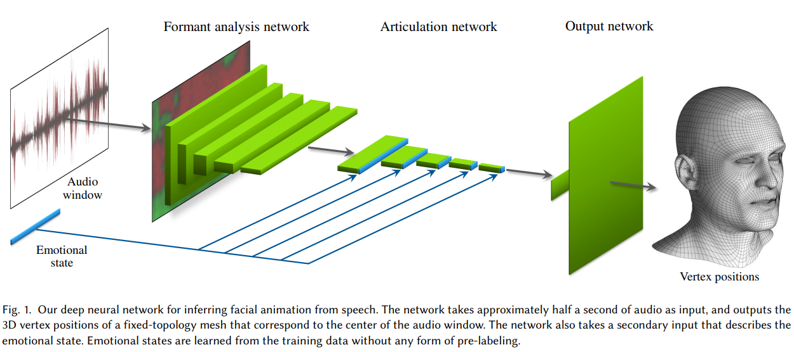

# Audio-Driven Facial Animation by Joint End-to-End Learning of Pose and Emotion
#### Tero Karras, Timo Aila, Samuli Laine, Antti Herva, Jaakko Lehtinen (SIGGRAPH 2017)

### Main Idea :
As audio-to-facial pose can is a complex one-to-many mapping, it is hard for a neural network to disambiguate possible poses for a given sound or phoneme. This paper presents a relatively simple way to solve this by learning jointly the output pose of a facial mesh and an *emotion* latent vector associated with every sound-window input in the dataset. 

### Main Takeaways :
* Learning latent vectors associated with each input can help disambiguation and avoids producing average poses for a given sound (or lack thereof).
* Learning such latent vectors seems mostly possible by adding a regularization term to the training based on the assumption or prior knowledge that such *emotion vector* features should vary at low frequencies compared to input sounds.
* Fine-tuning weights on multiple losses can be avoided with a Adam-inspired loss normalization technique. This seems to be a useful, general technique.
* A lot of manual filtering of the emotion vectors still need to be done to retreive naturally-recognizable emotions.

### Method
The architecture of the system is shown in the Figure 1 of the paper:

