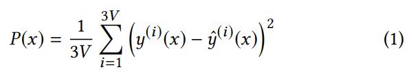

# Audio-Driven Facial Animation by Joint End-to-End Learning of Pose and Emotion
#### Tero Karras, Timo Aila, Samuli Laine, Antti Herva, Jaakko Lehtinen (SIGGRAPH 2017)

### Main Idea :
As audio-to-facial pose can is a complex one-to-many mapping, it is hard for a neural network to disambiguate possible poses for a given sound or phoneme. This paper presents a relatively simple way to solve this by learning jointly the output pose of a facial mesh and an *emotion* latent vector associated with every sound-window input in the dataset. 

### Main Takeaways :
* Learning latent vectors associated with each input can help disambiguation and avoids producing average poses for a given sound (or lack thereof).
* Learning such latent vectors seems mostly possible by adding a regularization term to the training based on the assumption or prior knowledge that such *emotion vector* features should vary at low frequencies compared to input sounds.
* Fine-tuning weights on multiple losses can be avoided with a Adam-inspired loss normalization technique. This seems to be a useful, general technique.
* A lot of manual filtering of the emotion vectors still need to be done to retreive naturally-recognizable emotions.

### Method
The architecture of the system is shown in the Figure 1 of the paper:

#### Data processing
The training data is composed of sound windows and associated 3D vertex positions of facial meshes.

The audio processing starts off with an auto-correlation layer (that I'm not familiar with) that computes K=12 auto-correlation coefficients for each audio frame. Their audio-windows of 520 ms are seperated into 64 overlapping audio-frames of 16ms. This results in this first layer outputing a 64x32 matrix for a given audio-window. I'm not familiar with audio-processing techniques, and I'm guessing that these auto-correlation computations are fixed, and that error gradients are not back-propagated into this layer. The following audio-processing part of the network is a series of standard Relu-activated convolution layers that are learned during training, along with the rest of the model.

The target data (poses) is acquired with a professional-grade facial tracking software that maps synchronized videos from 9 cameras to an unstructured facial mesh animation. From my understanding, this animation is retargeted to a custom-made, fixed-topology mesh, which is re-positioned and re-oriented automatically. The **deltas** from a neutral pose for each keyframe in that generated facial animation are exported as the training targets.

#### Emotion latent vectors
Each training input is augmented with a small (16 or 24 dimensional) latent vector for which each component is initialized by drawing from a normal distribution. These vectors are appended to each layer output of the articulation network shown in Figure 1. These are **learnable parameters** that should help the network disambiguate between emotion states for similar sounds. The authors explain that using too few dimensions for these vectors leads the network to not being able to disambiguate successfully, while using too many dimensions leads to emotion vectors that are *too specialized* and hard to extract for general inference.

#### Training losses
The main element for this technique to work seem to be in the way the authors define their losses and their regularization terms. 

The first loss, is the Position loss or *Position Term* as they call it which is the naïve loss that would come in mind to train such a network, where you want to minimize the distance between the outputs and the targets. Given *y* as the target vector for the *V* vertices of the mesh and *ŷ* as the output of the network, the *Position Term* is defined as the average squared difference for each vertex of the mesh:

