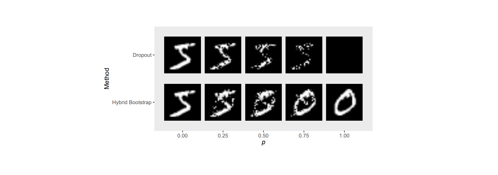

# The Hybrid Bootstrap: A Drop-in Replacement for Dropout
#### Robert Kosar, David W. Scott (2018)

### Main Idea :
A new alternative for dropout that randomly swaps features from another training example during training instead of fixing it to zero as in normal dropout.

### Main Takeaways :
* Hybrid Bootstrap empirically tends to yield better generalization results than normal dropout (experiments on MNIST, CIFAR)
* Hybrid Bootstrap doesn't require re-scaling of the activations w.r.t. *p* as does normal dropout. 
* Specifying an upper bound (*u*) for the probability of dropout (*p*), and then sampling *p*~Uniform(0,*u*) at each iteration seems more robust to hyper-parameter tuning than directly specifying *p*.
* The CNN-specific modifications to the method (spatial grid bootstrap & channel hybrid bootstrap) do not seem to offer considerable performance gains.

### Method:
The hybrid bootstrap method can be summarized in a single equation:

***n*** = ***x e*** + ***v*** **(1 -** ***e*** **)**

Where ***x*** is the actual input/feature vector, ***e*** is a vector of the same dimension as ***x*** and drawn from Bernoulli(1-*p*) and ***v*** is a random input/associated feature vector from the dataset. 

Visually, Figure 1 from the article compares Hybrid bootstrapping with regular dropout without re-scaling:

