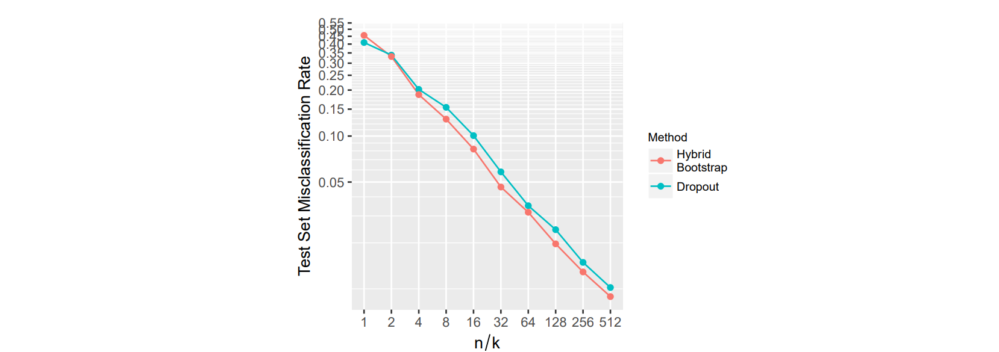
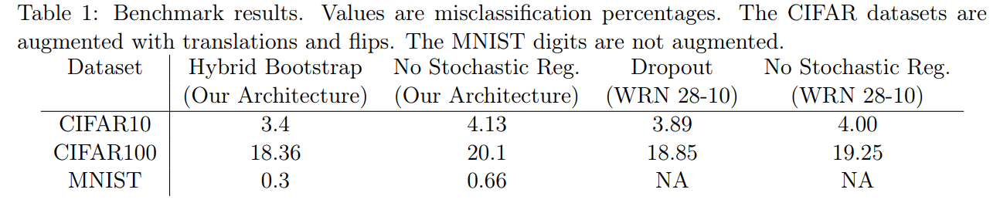
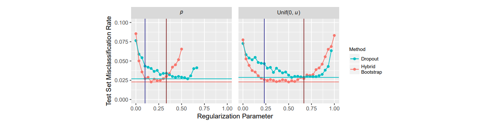

# The Hybrid Bootstrap: A Drop-in Replacement for Dropout
#### Robert Kosar, David W. Scott (2018)

### Main Idea :
A new alternative for dropout that randomly swaps features from another training example during training instead of fixing it to zero as in normal dropout.

### Main Takeaways :
* Hybrid Bootstrap empirically tends to yield better generalization results than normal dropout (experiments on MNIST, CIFAR)
* Hybrid Bootstrap doesn't require re-scaling of the activations w.r.t. *p* as does normal dropout. 
* Specifying an upper bound (*u*) for the probability of dropout (*p*), and then sampling *p*~Uniform(0,*u*) at each iteration seems more robust to hyper-parameter tuning than directly specifying *p*.
* The CNN-specific modifications to the method (spatial grid bootstrap & channel hybrid bootstrap) do not seem to offer considerable performance gains.

### Method:
The hybrid bootstrap method can be summarized in a single equation:

***n*** = ***x e*** + ***v*** **(1 -** ***e*** **)**

Where ***x*** is the actual input/feature vector, ***e*** is a vector of the same dimension as ***x*** and drawn from Bernoulli(1-*p*) and ***v*** is a random input/associated feature vector from the dataset. In their work, the authors use shifted minibatches views to choose the random input/feature vector ***v*** that will corrupt ***x***. They report that shifting the corruption miniatch view further at each layer gives better results than corrupting with activations from the same input on each layer. In other words, they corrupt the input 1 in the minibatch with values of input 2, and feature vector of input 1 at layer 1 with feature vector of input 3, and so on.

Visually, Figure 1 from the article compares Hybrid bootstrapping with regular dropout without re-scaling:

### Results, and fair comparisons
The main difficulty the authors seemed to have encountered in their experiments was to provide fair comparisons between dropout and hybrid bootstrap. In their tests for MNIST, they use different *u* values for both techniques, which I assume were found by cross-validation, even though this is not clear. In their tests with a bigger CNN architecture for MNIST and CIFAR datasets, they reject their own results using dropout in the same locations as with hybrd bootstrapping because the performance is *much worse* than with their method. The large drop in accuracy when switching to dropout with CIFAR100 is rather strange to me, and might hint at a problem in their implementation of dropout or elsewhere. They therefore revert to report results from prior work with a slightly different training procedure for "fairer" comparisons which makes little sense to me. Still, in every case, their technique shows slighly better generalization in all cases.   

Here is a comparison of the performances of their method vs. dropout on the MNIST with a simple architecture, with respect to the numbder of examples (*n*) per class (*k*):

Here is their Table of results for a bigger architecture applied on MNIST and CIFAR10/100:

### Sampling *p* at each iteration instead of fixing it for all training.
For me, one of the most interesting points, besides the the proposed technique, is the trick proposed to be more robust to the dropout penality (I am not sure if this was proposed before, but I was unaware of this). Instead of specifying a value for the dropout probability *p*, the authors suggest to instead specify an upper bound *u* for a uniform distribution: Uniform(0,*u*) from which to sample *p* at each iteration. They empirically show that "*performance is much less sensitive to the choice of u than it is to the choice of p*".

Figure 3 from the article is perhaps the most interesting one in my opinion and shows these claims about tuning *u* vs *p*:

### Conclusion
This papers presents a novel alternative to dropout, which seems to give slightly better generalization results at the cost of a more complicated implementation, but struggles to show clear, fair comparisons. I read the first version of this paper on arxiv and feel that a new version with (1) better comparisons and (2) more implementation details - or details on the computational/memory cost compared to dropout - would be very interesting. They also present a way to sample the dropout probability at each iteration that helps hyper-parameter tuning that seems easy to implement.
